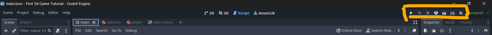

### For Godot 3D game ####
1. Clone the repository.
2. Go to GameDev folder then GodotGame and then go to 3d folder.
3. Open `Godot_v4.2.2-stable_win64` which is present in Godot_v4.2.2-stable_win64 folder in downloads
4. Click on import new project and then put the project path till 3D game and click open
5. On double clicking project, it will open up in a window
6. CLick on play button on the top right corner.

### For changing Player asset ####
1. Go to player scene in scenes folder then click on 3D
2. MeshInstance 3D , In inspector on the right side you can change shape from Mesh, add color from Surface material Override.
`Remember once you change your Shape, change CollisionShape according to the shape you selected`
3. Go Albedo to change colors.
4. In transform, you can increase or decrease scale(size of the object).
5. Now Go to project setting, and in project setting go to > Input Map(mapping key binding)
6. In add action, create your own customized action.
7. Add key bindings relevant to the actions, you can even change them.
8. Now click on Script from the top
9. Firstly you can change speed, acceleration rate, jump force etc.
10. In Physics_process, you can add your logic like if the player is going out of the plane what to do like respwan at the begining etc.

### For changing Obstacles
1. Go to Obstacle scene in scenes folder then click on 3D
2. MeshInstance 3D , In inspector on the right side you can change shape from Mesh, add color from Surface material Override.
`Remember once you change your Shape, change CollisionShape according to the shape you selected`
3. Go Albedo to change colors.
4. In transform, you can increase or decrease scale(size of the object).
5. In Script, you can change the height from which it is falling.
6. 

### For deploying to Web ###
1. On the main screen, click on Project menu from the Navbar.
2. Click on Export.
3. On clicking on export, a window will appear, Under presets you will see `Web Runnable`.
4. If you don't see `Web Runnable` click on ADD, and under add click on `Web `.
5. Once you click, it will ask to download and install, click on that button.
6. Then in Preset, click on Web, under web click Export Project.
7. Create a folder and in folder save the html file.
8. Add the Server.py to folder where you saved the html file.
9. Open Command Prompt and navigate to folder where you saved html file.
10. Then run the server.py file.
11. In the browser, hit `http://localhost:8000`.
12. Then click on the html file which you saved.
