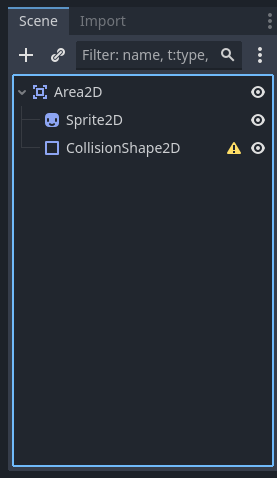

    Godot is a game engine. Think of it as a special tool that helps you create video games. Just like how you use a pencil and paper to draw, game developers use Godot to make games.
    Key Concepts in Godot
    Scenes and Nodes
    Scene: Imagine a scene like a page in a storybook. Each scene can be a different part of your game, like a menu, a level, or a character.
    Node: Nodes are like the building blocks of your scene. They can be characters, objects, or even things like sounds or lights.
    Scripting with GDScript

    GDScript: This is the special language we use to tell our game what to do. It's like giving instructions to your game.
    Sprites

    Sprite: A sprite is a 2D image or animation in your game. If you have a character or a coin, that's a sprite.
    Physics

    Physics: This is what makes your game feel real. It's the rules that make things fall, bounce, or stop.

    Now let's see the game, you must have often seen a running dyno game while you are not connected to internet, Lets create a similar game to it.

### For Godot 2D game ####
1. Clone the repository.
2. Go to GameDev folder then GodotGame and then go to dino_run.
3. Open `Godot_v4.2.2-stable_win64` which is present in Godot_v4.2.2-stable_win64 folder in downloads
4. Click on import new project and then put the project path till dino_run and click open
5. On double clicking project, it will open up in a window
6. CLick on play button on the top right corner.

## For deploying to Web ##
1. On the main screen, click on Project menu from the Navbar.
2. Click on Export.
3. On clicking on export, a window will appear, Under presets you will see `Web Runnable`.
4. If you don't see `Web Runnable` click on ADD, and under add click on `Web `.
5. Once you click, it will ask to download and install, click on that button.
6. Then in Preset, click on Web, under web click Export Project.
7. Create a folder and in folder save the html file.
8. Add the Server.py to folder where you saved the html file.
9. Open Command Prompt and navigate to folder where you saved html file.
10. Then run the server.py file.
11. In the browser, hit `http://localhost:8000`.
12. Then click on the html file which you saved.

## Features that can be changed ##
`Main Script`
1. Obstacle type, they can add or remove obstacles
2. Starting position of Dyno can be changed
3. Speed , max difficulty, speed modifier can be changed.

`Making Obstacles`
1. From the Navbar, click on Scene -> New Scene.
2. Click on other Node.
3. After clicking on other Node, an dialog box will appear in it search for `Area2D`.
4. Now do right click Area2D and add child Node.
5. In child Node add 2 child Node one is `Sprite2D` and other one is `CollisionShape2D`. See the below image your scene must look like below

6. Now change the setting two 2D, and then click on Sprite2D
7. From Asset, search an image for which you want to make obstacle, and drag and place in Texture in Sprite2D(present in inspector window).
8. On click on Collision2D, and go to inspector and click on shape and select appropriate shape.
9. Click on save.
10. Add scene using preload function in main script.

 ## Creating Scene ##

## Creating Dyno Asset #######
 1. Click on Scene from navBar on the top of the screen.
 2. Once you click scene, you will be able to see a dropdown menu from there select New Scene
 3. Under the  Scene on top left side of the screen in a box you will see options 2D scene, 3D scene, Other node etc.
4. Click on other Node and in search bar select CharacterBody2D.
5. on left side you will be CharacterBody2D, right click on it and select add child node.
6. In dialog box, search AnimatedSprite2D. You will get a yellow warning symbol `Don't worry`.

7. Add two more child nodes for CharacterBody2D, of CollisionShape2D.
8. Click on AnimatedSprite2D, Go to inspector window on the right, Under AnimatedSprite2D, in animation, in Sprite frames Select on SpriteFrames from the dropdown.
9. Then click on Sprite Frames you will see an animation window will open at the bottom.
10. In this window under Animation Frames, you will see a mesh icon(add frames).
11. On Clicking the add Frames, a dialog box will open where search for your image for the animation, Here select `mort.png` and click open.
12. In dialog box in horizontal place holder make it `24` and in vertical make it `1 `.
13. In frames, we need to add more animations, like for run, jump,  duck and ideal, so click on add animation from the top left on animation window,
14. Add Frames according to tha animation. For Run the frames are from 6-9, for ideal animation it is from 0-5 and for duck it is from 10-12.
15. Rename CollisionShape 2D as Run and Duck.
16. For making the run collision frame, go to frames and click on run and then click on run col, and then in inspector window under CollisionSHape2D, in shape select rectangleShape2, and then adjust the boundaries of the rectangle with the head and tail of dyno.
17. Similar do for duck select duck animation and repeat step 16.
18. For improving texture in AnimatedSprite2D, in texture, in Filter select Nearest.
